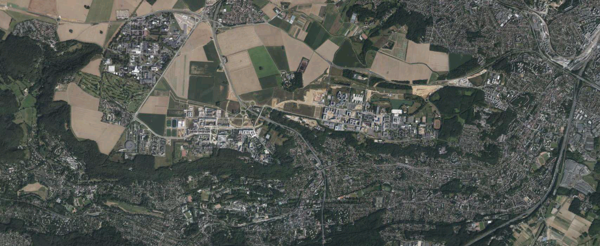

# Carte embarquée
## Objectif : 
Mettre en place un système permettant de faire bouger une carte sur l'écran d'un STM32.

On utilise une carte IGN au format BMP RGB565 de taille 1707x700.

On affichera sur un écran LCD de taille 480x272.
Pour cela on aura un travail de redimensionnement. 

[comment]: <> (Explique les différentes fonctions)

## Taches :
* Déplacement : calcule le déplacement avec l'appui
* Affichage : s'occupe d'afficher l'image s'il y a un mouvement qui est demandé.
* Joystick : s'occupe de regarder si un mouvement est demandé depuis le joystick et si un mouvement est demandé, on l'envoie dans la queue.

## Queues :
* déplacement : transmet la structure mouvement (dx,dy) de la mesure du déplacement à l'affichage qui se charge de remplir l'image à afficher. 

## Fonctions :
* Remplir image : rempli les pixels en reprenant l'image avec les bonnes coordonnées
* Fabriquer entête : fabrique l'entête du fichier BMP

Lien du site: https://atlantis294.github.io/442-Projet/

Jules FARNAULT
23/04/2024